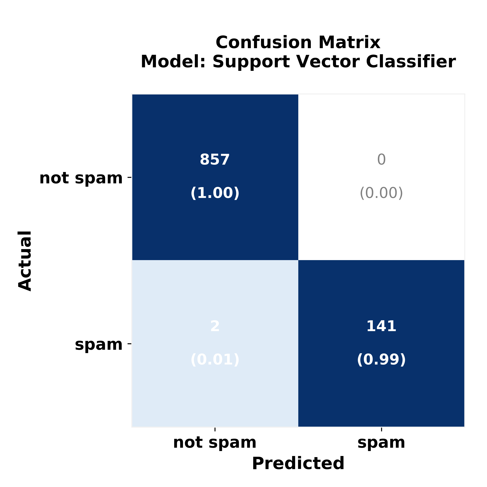

<br>

# GloVe Embeddings to filter SMS Spam


[**CLICK HERE**](https://nbviewer.jupyter.org/github/reyvaz/GloVe-SMS/blob/master/glove_sms.ipynb) to see the notebook in Jupyter nbviewer

## Uses GloVe embeddings to filter out spam in text messages

The specification is able to tag every legitimate sms message correctly, while filtering out over 99% of spam messages. 

The dataset was downloaded from [Kaggle](https://www.kaggle.com/uciml/sms-spam-collection-dataset), and can also be found at the [UCI Machine Learning Repository](https://archive.ics.uci.edu/ml/datasets/SMS+Spam+Collection). Acknowledgements to Tiago A. Almeida and José María Gómez Hidalgo, creators  of the original dataset. More information can be found [here](http://www.dt.fee.unicamp.br/~tiago/smsspamcollection/).

The GloVe encodings used are the 50 dimensional, 400K vocabulary from the the `glove.6B.zip`. More information and download link can be found [here](https://nlp.stanford.edu/projects/glove).

#### Model Performance Metrics
```
               precision   recall   f1-score   
   not spam       1.00      1.00      1.00       
       spam       1.00      0.99      0.99       
        avg       1.00      1.00      1.00      

AUC  = 0.993
Train Accuracy = 0.998
Test Accuracy  = 0.998
```

#### Contents 

* [glove_sms.ipynb](glove_sms.ipynb): Jupyter Notebook containing the classification models. 
* [glove_sms_utils.py](glove_sms_utils.py): Python scrypt containing some auxiliary functions.
* [cm_heat_plots.py](cm_heat_plots.py):  Python scrypt containing functions to create confusion matrix plots.
* [spelling_v2.py](spelling_v2.py): Python scrypt containing a spelling corrector.
* [data](data): Auxiliary data files used for the spelling corrector and the corrector's output. NOTE: it does not contain the data for the analysis, that data can be downloaled here [direct link](https://www.kaggle.com/uciml/sms-spam-collection-dataset/downloads/sms-spam-collection-dataset.zip).
* [media](media): Output and auxiliary images.
* [README.md](README.md): this file.

<br>
<p align="center">
<a href="https://reyvaz.github.io/Glove-SMS/" 
rel="see html report">
</a>
</p>
<br>

[**GitHub Pages**](https://reyvaz.github.io/GloVe-SMS)

<hr>
<br>
